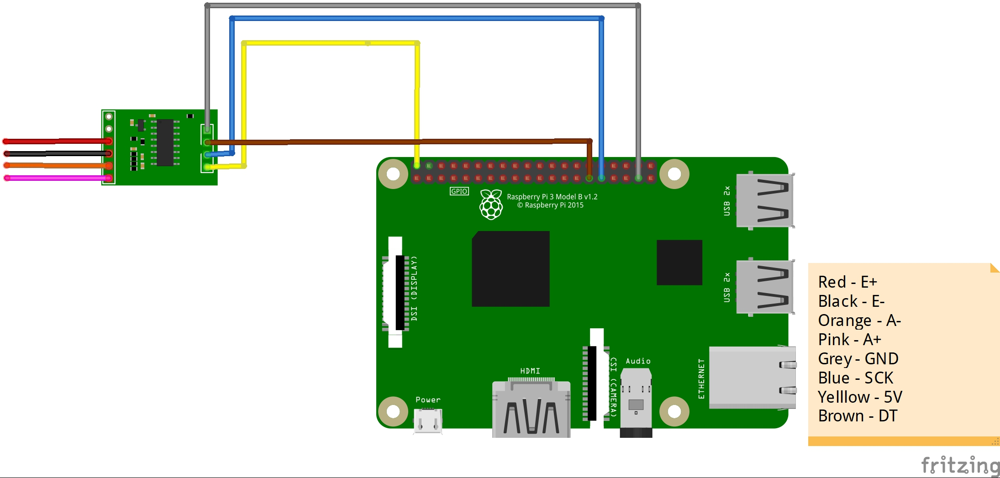

## About
This project uses Raspberry Pi to continuously monitor the weight and contents in waste bins to minimize the wastage of food in canteens and eateries.

## Requirements

### Hardware:

1. Raspberry Pi 3 Model B or Raspberry Pi 4 Model B
2. [Raspberry Pi camera module (with a CSI cable)](https://www.amazon.in/Raspberry-Camera-Module-Webcam-Support/dp/B0B5B4CVCH/ref=sr_1_3?crid=DUUVQV0TE3Y6&keywords=csi+camera&qid=1694550717&sprefix=csi+camser%2Caps%2C285&sr=8-3)
3. Weight sensor used in this project:
	- [Load cell](https://www.amazon.in/SunRobotics-Load-Cell-Weighing-Sensor/dp/B075XFGKF2/ref=sr_1_2_sspa?adgrpid=1319415562800870&hvadid=82463731551059&hvbmt=bp&hvdev=c&hvlocphy=158174&hvnetw=s&hvqmt=p&hvtargid=kwd-82464355243409%3Aloc-90&hydadcr=2172_1927000&keywords=load+cells&qid=1694550551&sr=8-2-spons&sp_csd=d2lkZ2V0TmFtZT1zcF9hdGY&psc=1)
	- [HX711 (ADC for load cell)](https://www.amazon.in/HX711-Load-Cell-Amplifier-Module/dp/B08P612WKS/ref=sr_1_15?crid=2YCYM3NB3KZ75&keywords=hx711&qid=1694550675&sprefix=hx711%2Caps%2C292&sr=8-15)

### Software:

1. Raspbian installed in the RPi
2. RPi weight sensor library compatible with HX711 [(can be found here)](https://github.com/gandalf15/HX711)
3. Camera Library for CSI camera to work
4. OpenCV library for detection of human beings
5. pyshine library for streaming of live footage through Wi-fi
6. HX711 library for weight measurement.

### Working of code:

This project helps you to setup a camera and weighing scale and integrate it to your Raspberry Pi. It also enables you to send this data over Wi-fi.

The stream.py file just starts a server at the specified port on the RPi. The main.py file has both the code integrated, for weight measurement and stream of live footage to the server. It also prints an alert message if the weight measured exceeds a certain amount of threshold.

>[!NOTE]  
>Uncomment the commented to connect to a remote desktop to get alerts through Wi-fi.

#### The post_proc_clinet.py:
This code works on the Haarcascades method of OpenCV. This is one of the most common methods used in real-world applications to identify and classify different types of objects in the given frame to the program.

### Connection of components:

>[!NOTE] 
>The connection of camera shown in the pictue is just for representation purpose. The actual connection is done using a CSI ribbon.

Components shown in picture:
- HX711
- Raspberry Pi Model 3

Corresponding pins on Load Cell:
- Red = E+
- Green = A+ 
- Black = E- 
- White = A-

Picture of load cell:


### Installation:

#### Python is installed by default in Raspberry Pi(Raspbian OS)

#### For live stream:

Update Raspbian OS in RPi
```bash
sudo apt update
sudo apt upgrade
```

Install required python packages in RPi
```bash
pip install opencv-python
pip install pyshine==0.0.9
```
Before running the Python script, to access the camera we need to enable it. To do this head to 

Main Menu > Raspberry Pi Configuration > Interfaces and enable the camera. 

Reboot you Pi so that the changes you made get reflected.

After installing all the required libraries on RPi, run the following command:
```bash
python3 stream.py
```

This will start a streaming of live footage from the camera connected to the RPi at the specified port. This can be accessed from any computer on the same network.

To set the IP address in the stream.py file first you have to identify your RPi's IP address in your network. To know that run the following command:
```bash
ipconfig
```
Copy the iPv4 address and replace the address in the code. Now your RPi's camera is ready to stream it's camera live.
Note: The default resolution of camera is set to 320x240. You can change this accordingly to your requirements in the code.

```python
capture.set(cv2.CAP_PROP_FRAME_WIDTH, 320)
capture.set(cv2.CAP_PROP_FRAME_HEIGHT, 240)
```

#### For weight sensor:

There are many libraries that support the weight sensor in C++, but we stick to Python as it is extremely compatible with Raspbian OS. To start with, install the HX711 library by running this command:
```bash
pip install HX711
```

But you can't still use your weight sensor. To use it, you have you calibrate it. For calibration measure a standard object and set the reference unit to one kilogram. Also don't forget to update the offset as the weighing scale might have some mass.

### If any post processing is required on the video footage from the RPi:

A sample for detecting human faces in the video footage is also given in the repository. Run it to detect human faces in the live stream.
```bash
python3 post_proc_client.py
```

>[!NOTE]  
>This file uses the haar cascades method to identify human faces. The xml file for opencv is obtained from an open-source [repository](https://github.com/anaustinbeing/haar-cascade-files/tree/master).

### References:

Anaustinbeing. “Anaustinbeing/Haar-Cascade-Files: A Complete Collection of Haar-Cascade Files. Every Haar-Cascades Here!” GitHub. Accessed September 13, 2023. https://github.com/anaustinbeing/haar-cascade-files/tree/master.

gandalf15. (n.d.). Gandalf15/HX711: Read HX711 ADC for weigh scales on Rasperry Pis. GitHub. https://github.com/gandalf15/HX711 

GitHub. Accessed September 13, 2023. https://github.com/savazeb/pyshine-example/blob/master/Stream.py.

Jude, Felix, jude mark 2, Jr, Greg, Daniel, Billynux, et al. “Build a Digital Raspberry Pi Scale (with Weight Sensor HX711).” Tutorials for Raspberry Pi, July 18, 2023. https://tutorials-raspberrypi.com/digital-raspberry-pi-scale-weight-sensor-hx711/.

“Pyshine.” PyPI. Accessed September 13, 2023. https://pypi.org/project/pyshine/.
