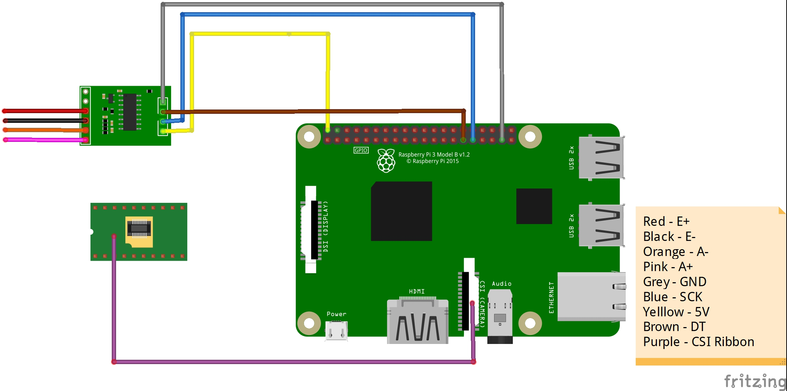

## Requirements

### Hardware:

1. Raspberry Pi 3 Model B or Raspberry Pi 4 Model B
2. [Raspberry Pi camera module (with a CSI cable)](https://www.amazon.in/Raspberry-Camera-Module-Webcam-Support/dp/B0B5B4CVCH/ref=sr_1_3?crid=DUUVQV0TE3Y6&keywords=csi+camera&qid=1694550717&sprefix=csi+camser%2Caps%2C285&sr=8-3)
3. Weight sensor
		sensor used in this project:
			- [Load cell](https://www.amazon.in/SunRobotics-Load-Cell-Weighing-Sensor/dp/B075XFGKF2/ref=sr_1_2_sspa?adgrpid=1319415562800870&hvadid=82463731551059&hvbmt=bp&hvdev=c&hvlocphy=158174&hvnetw=s&hvqmt=p&hvtargid=kwd-82464355243409%3Aloc-90&hydadcr=2172_1927000&keywords=load+cells&qid=1694550551&sr=8-2-spons&sp_csd=d2lkZ2V0TmFtZT1zcF9hdGY&psc=1)
			- [HX711 (ADC for load cell)](https://www.amazon.in/HX711-Load-Cell-Amplifier-Module/dp/B08P612WKS/ref=sr_1_15?crid=2YCYM3NB3KZ75&keywords=hx711&qid=1694550675&sprefix=hx711%2Caps%2C292&sr=8-15)

### Software:

1. Raspbian installed in the RPi
2. RPi weight sensor library compatible with HX711 [(can be found here)](https://pypi.org/project/hx711/)
3. Camera Library for CSI camera to work
4. OpenCV library for detection of human beings
5. pyshine library for streaming of live footage through Wi-fi
6. HX711 library for weight measurement.

### Working of code:

The stream.py file just starts a server at the specified port on the RPi. The main.py file has both the code integrated for weight measurement and stream of live footage to the server. It also sends an alert message to a different port mentioned in code if the wight measured exceeds a certain amount of threshold.

##### The post_proc_clinet.py:
This code works on the Haarcascades method of OpenCV. This is one of the most common methods used in real-world applications to identify and classify different types of objects in the given frame to the program.

### Connection of components:

Components shown in picture:
- HX711
- Raspberry Pi Model 3

Note: The connection of camera is not shown in the pictue.

### Installation:

#### Python is installed by default in Raspberry Pi(Raspbian OS)

#### For live stream:

Update Raspbian OS in RPi
```bash
sudo apt update
sudo apt upgrade
```

Install required python packages in RPi
```bash
pip install opencv-python
pip install pyshine==0.0.9
```

After installing all the required libraries on Raspberry Pi run the following command:
```bash
python3 stream.py
```

This will start a streaming of live footage from the camera connected to the RPi at the specified port. This can be accessed from any computer on the same network.

To set the IP address in the stream.py file first you have to identify your RPi's IP address in your network. To know that run the following command:
```bash
ipconfig
```
Copy the iPv4 address and replace the address in the code. Now your RPi's camera is ready to stream it's camera live.
Note: The default resolution of camera is set to 320x240. You can change this accordingly to your requirements.

#### For weight sensor:

There are many libraries that support the in C++, but we stick to Python as it is extremely compatible with Raspbian OS. To start with, install the HX711 library by running this command:
```bash
pip install HX711
```

But you can't still use your weight sensor. To use it, you have you calibrate it. For calibration please follow this [tutorial](https://tutorials-raspberrypi.com/digital-raspberry-pi-scale-weight-sensor-hx711/).

### If any post processing is required on the video footage from the RPi:

A sample for detecting human faces in the video footage is also given in the repository. Run it to detect human faces in the live stream.
```bash
post_proc_client.py
```

Note: This file uses the haar cascades method to identify human faces. The xml file for opencv is obtained from an open-source [repository](https://github.com/anaustinbeing/haar-cascade-files/tree/master).
### References:

Anaustinbeing. “Anaustinbeing/Haar-Cascade-Files: A Complete Collection of Haar-Cascade Files. Every Haar-Cascades Here!” GitHub. Accessed September 13, 2023. https://github.com/anaustinbeing/haar-cascade-files/tree/master.

Endail. “Endail/HX711-Rpi-Py: Python Bindings for Raspberry Pi HX711 C++ Library.” GitHub. Accessed September 13, 2023. https://github.com/endail/hx711-rpi-py/tree/master.

GitHub. Accessed September 13, 2023. https://github.com/savazeb/pyshine-example/blob/master/Stream.py.

“HX711.” PyPI. Accessed September 13, 2023. https://pypi.org/project/hx711/.

Jude, Felix, jude mark 2, Jr, Greg, Daniel, Billynux, et al. “Build a Digital Raspberry Pi Scale (with Weight Sensor HX711).” Tutorials for Raspberry Pi, July 18, 2023. https://tutorials-raspberrypi.com/digital-raspberry-pi-scale-weight-sensor-hx711/.

“Pyshine.” PyPI. Accessed September 13, 2023. https://pypi.org/project/pyshine/.